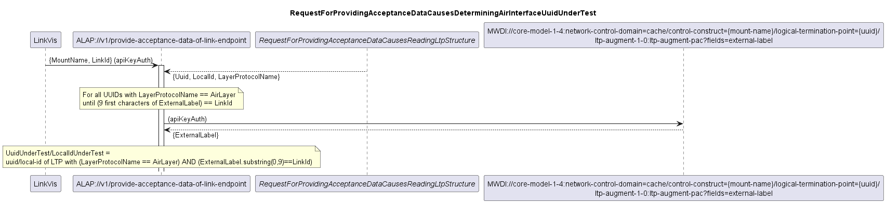
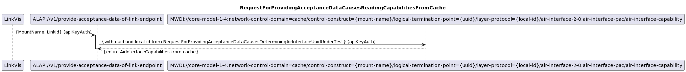
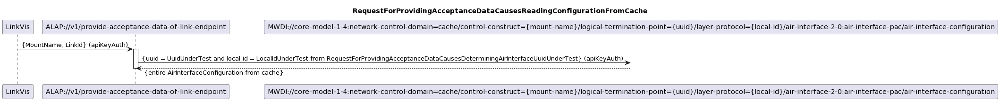
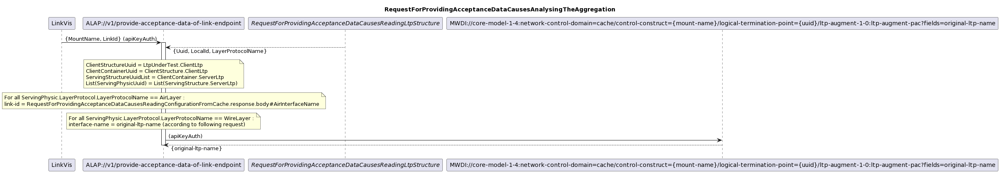
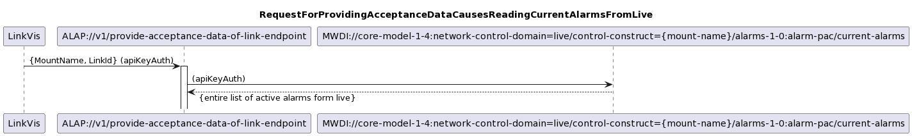
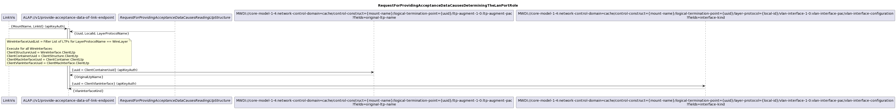
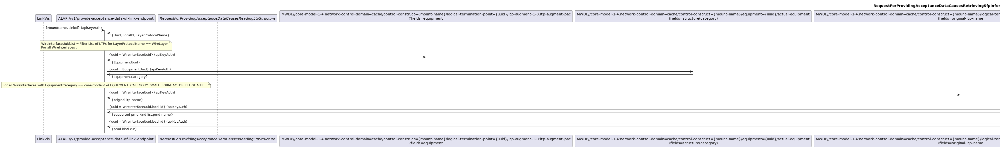
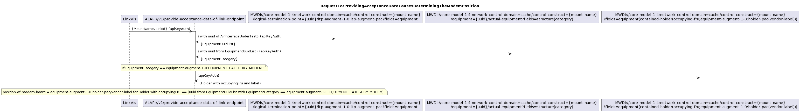
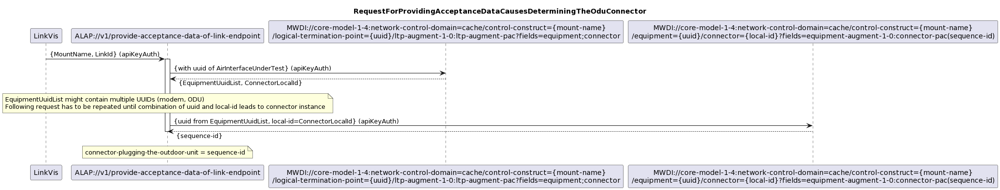
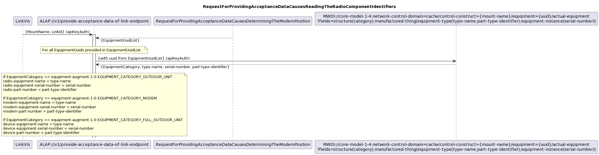

# AutomatedLinkAcceptance Diagrams
.  
.  
  
.  
.  
  
.  
.  
  
.  
.  
  
.  
.  
  
.  
.  
  
.  
.  
  
.  
.  
  
.  
.  
  
.  
.  
  
.  
.  
  
.  
.  
  
.  
.  
  
.  
.  
  
.  
.  